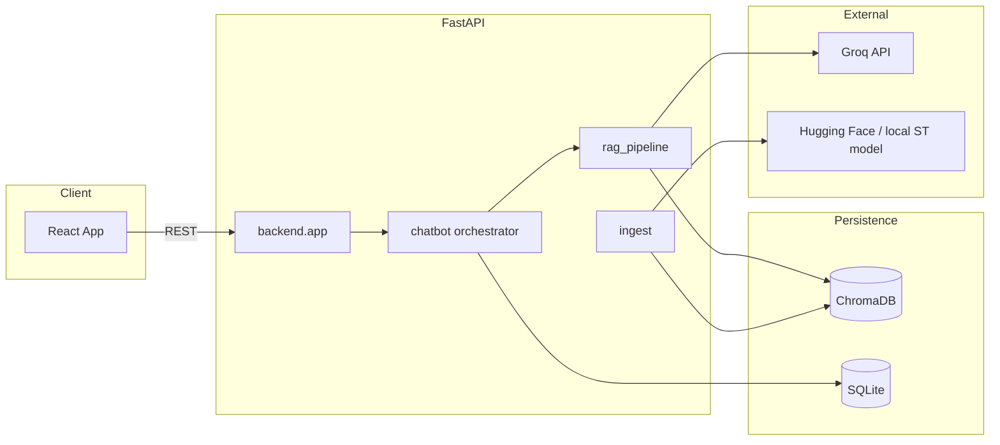

# MACE AI Academy — Intelligent RAG Chatbot

<div align="center">

**A production-oriented, conversational course counselor powered by Retrieval-Augmented Generation (RAG)**

[](https://www.python.org/)
[](https://fastapi.tiangolo.com/)
[](https://react.dev/)

</div>

---

## Overview

**MACE AI Academy RAG Chatbot** is a full-stack application that helps students explore courses, fees, syllabi, placements, and FAQs through a natural **conversational interface**. Answers are **grounded** in your own documents (`data/`) using embeddings and ChromaDB retrieval, then synthesized by a **Groq-hosted LLM**. The system persists **chat history** in SQLite, supports **document upload and re-ingestion**, and includes a **lead capture** flow for counselor callbacks.

Designed for local development, Docker Compose, and straightforward deployment to platforms that support containers (e.g., Railway, Render) or static frontend + API services (e.g., Vercel for UI + separate API host).

---

## Features

| Area | Capability |
|------|------------|
| **RAG** | PDF, TXT, DOCX, CSV ingestion; chunking (`500` / `100` overlap); Sentence Transformers embeddings; ChromaDB vector store |
| **LLM** | Groq API (default: `llama-3.3-70b-versatile`) with conversational system prompts and multi-turn memory |
| **Chat** | Guest sessions, sidebar history, suggested prompts, follow-up chips, optional typing-style reveal, voice input (Web Speech API) |
| **API** | REST API with OpenAPI (`/docs`), health check, CORS configuration |
| **Data** | Upload documents via API; manual re-ingest; analytics endpoint for leads and usage stats |
| **UI** | Dark, ChatGPT-inspired layout (React + Vite + Tailwind); dev proxy to backend for smoother local networking |

---

## Tech Stack

### Backend

| Technology | Purpose |
|------------|---------|
| **Python 3.10+** | Runtime |
| **FastAPI** | HTTP API, validation, OpenAPI |
| **Uvicorn** | ASGI server |
| **LangChain** | RAG orchestration, Groq integration, document loaders |
| **ChromaDB** | Vector persistence |
| **sentence-transformers / Hugging Face** | Embeddings (`sentence-transformers/all-MiniLM-L6-v2`) |
| **Groq** | Hosted LLM inference |
| **SQLite** | Conversations, messages, leads |
| **pydantic-settings** | Environment-based configuration |

### Frontend

| Technology | Purpose |
|------------|---------|
| **React 18** | UI |
| **Vite 5** | Build tooling and dev server (port **3000**) |
| **Tailwind CSS** | Styling |
| **lucide-react** | Icons |

### DevOps

- **Docker** & **Docker Compose** — multi-service orchestration  
- **Nginx** — static frontend in production Docker image  

---

## Architecture



---

## Installation

### Prerequisites

- **Python** 3.10 or newer  
- **Node.js** 18+ and **npm**  
- **[Groq API key](https://console.groq.com/)** (required for live LLM; optional graceful degradation without key)  

### 1. Clone and environment

From the **project root** (`mace-ai-chatbot/`):

```bash
git clone <your-repo-url>
cd mace-ai-chatbot
```

Copy environment templates:

```bash
# Windows (cmd)
copy .env.example .env

# Linux / macOS
cp .env.example .env
```

Edit `.env` and set at minimum:

```env
GROQ_API_KEY=your_groq_key_here
```

### 2. Backend (virtual environment recommended)

Always run backend commands from the **repository root** so `backend` resolves as a package.

```bash
python -m venv venv

# Windows
venv\Scripts\activate

# Linux / macOS
source venv/bin/activate

pip install -r backend/requirements.txt
```

Build the vector store from `data/`:

```bash
python -m backend.ingest
```

Start the API:

```bash
uvicorn backend.app:app --reload --host 127.0.0.1 --port 8000
```

**Windows helper:** `./start_backend.ps1` — same as above from project root.

> **Note:** First startup loads the embedding model; allow **30–90 seconds** before assuming the server failed.

### 3. Frontend

```bash
cd frontend
npm install
npm run dev
```

**Windows helper:** `./start_frontend.ps1` from project root (prepends typical Node.js path).

The dev server listens on **http://localhost:3000**. In development, API calls use the Vite **`/api` proxy** to `http://127.0.0.1:8000` (see `frontend/vite.config.js`).

### 4. Docker Compose (full stack)

```bash
docker compose up --build
```

- Frontend: **http://localhost:3000**  
- Backend: **http://localhost:8000**  

Ensure `./.env` exists with `GROQ_API_KEY` for the backend service.

---

## Usage

### End users (browser)

1. Start **backend** (port **8000**).  
2. Start **frontend** (`npm run dev`, port **3000**).  
3. Open **http://localhost:3000**.  
4. Click **New chat**, use suggestions or type questions; optionally use voice input where supported.

### Operators

| Action | How |
|--------|-----|
| Rebuild vectors after editing `data/` | `POST /reingest` or `python -m backend.ingest` |
| Add documents via API | `POST /upload` (multipart file) |
| Inspect API | **http://127.0.0.1:8000/docs** (redirect from `/`) |
| Health | **GET /health** |

### Sample conversation flow

```text
User: What courses does MACE AI Academy offer?
Bot: … (grounded reply from FAQ / prospectus chunks)

User: Tell me more about fees for the Data Science program.
Bot: … (uses prior context + retrieval)
```

---

## Folder Structure

```text
mace-ai-chatbot/
├── README.md                    # This file
├── .env.example                 # Root environment template
├── .gitignore
├── docker-compose.yml           # Backend + frontend services
├── requirements.txt             # Pip convenience include (references backend reqs)
├── start_backend.ps1            # Windows: start uvicorn from root
├── start_frontend.ps1           # Windows: npm run dev from frontend/
├── app.log                      # Generated at runtime (if logging to file)
├── mace_chatbot.db             # SQLite (created on first run)
│
├── backend/
│   ├── __init__.py
│   ├── app.py                  # FastAPI routes & CORS
│   ├── chatbot.py              # SQLite: conversations, messages, leads
│   ├── config.py               # Settings & path resolution (project root)
│   ├── ingest.py               # Load/split/embed → ChromaDB
│   ├── rag_pipeline.py         # Retrieve + Groq chat with history
│   ├── prompts.py              # Counselor-style system + RAG instructions
│   ├── utils.py                # Logging helpers
│   ├── requirements.txt
│   ├── Dockerfile
│   └── .env.example
│
├── frontend/
│   ├── public/
│   ├── src/
│   │   ├── App.jsx
│   │   ├── main.jsx
│   │   ├── index.css
│   │   ├── api/client.js       # fetch wrapper + dev /api proxy
│   │   ├── components/         # ChatWindow, Sidebar, MessageBubble, etc.
│   │   ├── hooks/
│   │   └── utils/              # time formatting, conversational chips
│   ├── index.html
│   ├── package.json
│   ├── vite.config.js
│   ├── tailwind.config.js
│   ├── postcss.config.js
│   ├── nginx.conf               # SPA + optional /api proxy in Docker
│   ├── Dockerfile
│   ├── .env.example
│   └── dist/                   # Produced by npm run build
│
├── data/                       # Knowledge base documents (TXT, PDF, DOCX, CSV)
│   ├── ai_course.txt
│   ├── analytics.txt
│   ├── data_science.txt
│   └── faq.txt
│
└── chroma_db/                  # Generated vector database (after ingest)
```

---

## Screenshots

> Place your UI screenshots in a `docs/images/` folder (or similar) and uncomment or adjust the paths below.

<!--
| Chat (dark UI) | API docs |
|:--------------:|:--------:|
|  |  |
-->

**Suggested captures**

1. **Main chat** — sidebar + conversation + composer  
2. **Swagger UI** — `http://127.0.0.1:8000/docs`  
3. **Suggested prompts / follow-up chips**  

To add screenshots to README:

```markdown

```

---

## API Configuration

### Environment variables (`/.env`)

| Variable | Description | Example |
|----------|-------------|---------|
| `GROQ_API_KEY` | Groq API secret | `gsk_...` |
| `MODEL_NAME` | Groq chat model ID | `llama-3.3-70b-versatile` |
| `EMBEDDING_MODEL` | Hugging Face model id | `sentence-transformers/all-MiniLM-L6-v2` |
| `CHROMA_DB_DIR` | Vector store directory (resolved vs project root) | `./chroma_db` |
| `DATA_DIR` | Document source folder | `./data` |
| `DATABASE_URL` | SQLite URL | `sqlite:///./mace_chatbot.db` |
| `PORT` | Desired API port (info / compose) | `8000` |
| `CORS_ORIGINS` | Comma-separated allowed origins | `http://localhost:3000,...` |

### Frontend (`/frontend/.env`)

| Variable | Description |
|----------|-------------|
| `VITE_API_URL` | **Production builds:** backend base URL. **Development:** overridden by `/api` proxy when `import.meta.env.DEV` |

### REST endpoints (summary)

| Method | Path | Description |
|--------|------|-------------|
| `GET` | `/` | Redirects to `/docs` |
| `GET` | `/health` | DB, vector store, Groq, model metadata |
| `GET` | `/conversations` | List conversations |
| `POST` | `/conversations` | Create conversation `{ "title" }` |
| `DELETE` | `/conversations/{id}` | Delete conversation |
| `GET` | `/conversations/{id}/history` | Message history |
| `POST` | `/chat` | `{ "question", "conversation_id" }` |
| `POST` | `/upload` | Multipart PDF/TXT/DOCX/CSV |
| `POST` | `/reingest` | Rebuild Chroma from `DATA_DIR` |
| `POST` | `/leads` | Lead submission |
| `GET` | `/admin/analytics` | Aggregated stats |

> **Authentication:** Currently **none** — suitable for demos and trusted networks only. Lock down via reverse-proxy auth, VPN, or add API keys / JWT before public exposure.

### cURL examples

```bash
# Health
curl -s http://127.0.0.1:8000/health | jq

# New conversation
curl -s -X POST http://127.0.0.1:8000/conversations \
  -H "Content-Type: application/json" \
  -d '{"title":"Demo"}'

# Chat (replace CONV_ID)
curl -s -X POST http://127.0.0.1:8000/chat \
  -H "Content-Type: application/json" \
  -d '{"question":"What courses do you offer?","conversation_id":"CONV_ID"}'
```

---

## RAG Pipeline (reference)

- **Chunking:** `chunk_size=500`, `chunk_overlap=100`  
- **Collection:** Chroma (`mace_academy`)  
- **Retrieval:** Similarity search; context + recent history passed to Groq  

---

## Future Enhancements

- [ ] Role-based authentication and optional JWT for `/chat`, `/upload`, `/admin/analytics`  
- [ ] Rate limiting and request logging / observability (OpenTelemetry)  
- [ ] Migrate LangChain **Chroma** import to **`langchain-chroma`** package (deprecation cleanup)  
- [ ] Automated tests (pytest + Playwright/Vitest)  
- [ ] Streaming SSE responses for lower perceived latency  
- [ ] Multi-tenant workspaces and separate vector collections  
- [ ] Admin UI for ingestion status and analytics  

---

## Contributing

Issues and pull requests are welcome. Please keep changes focused and match existing code style. Do **not** commit `.env`, API keys, or `venv/` / `node_modules/`.

---

## Author

**Eshwar**  
 Maintainer of this MACE AI Academy chatbot fork.

<!-- Optional: replace with your links -->

- **GitHub:** [@your-username](https://github.com/your-username)  
- **Project:** Private / organization repository — adjust as needed  

---

## Acknowledgments

- [Groq](https://groq.com/) for LLM inference  
- [LangChain](https://www.langchain.com/) ecosystem  
- [ChromaDB](https://www.trychroma.com/) vector database  
- [FastAPI](https://fastapi.tiangolo.com/)  

---

<div align="center">

**Built for MACE AI Academy · Learn responsibly, cite your sources.**

</div>
